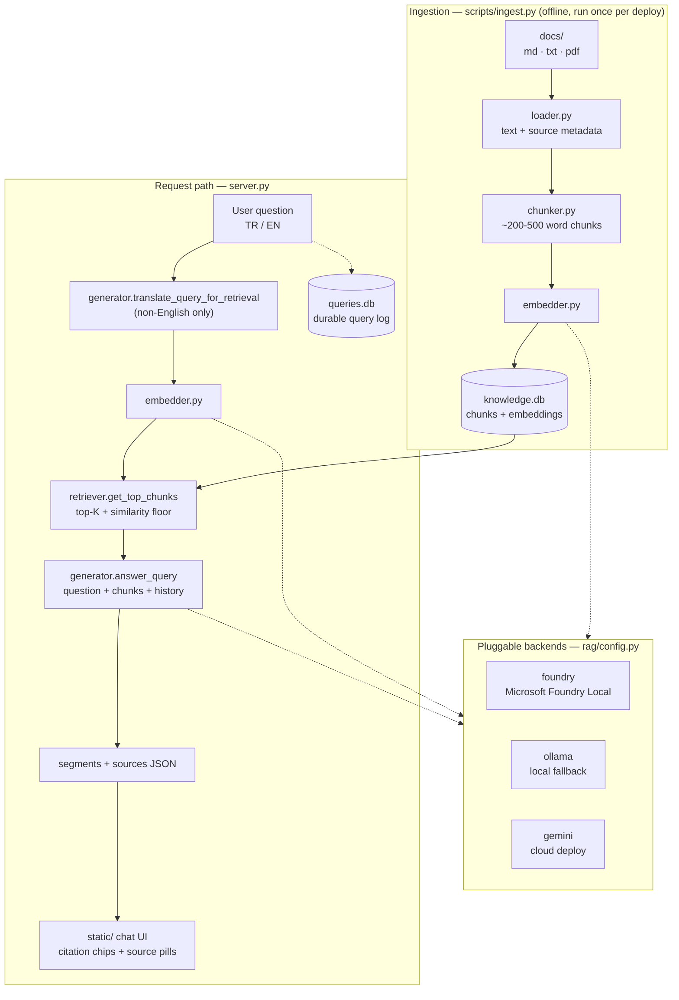

<h1 align="center">🐾 SHSU Transfer Assistant</h1>

<p align="center">
  <strong>A bilingual (Turkish&nbsp;/&nbsp;English) RAG chatbot that answers transfer questions for Fırat University software engineering students moving to Sam Houston State University — with inline citations, and fully offline by default.</strong>
</p>

<p align="center">
  <a href="https://bearkat-transfer-assistant.onrender.com"></a>
  
  
  
  <a href="LICENSE"></a>
</p>

<p align="center">
  <a href="https://bearkat-transfer-assistant.onrender.com"><strong>▶ Try it live</strong></a> ·
  <a href="#how-it-works">How it works</a> ·
  <a href="#quick-start">Quick start</a> ·
  <a href="#configuration">Configuration</a> ·
  <a href="#api">API</a>
</p>

> The public demo runs in cloud mode (Gemini) on Render's free tier, so the first request
> after a period of inactivity can take up to a minute while the instance wakes up.

---

## Table of contents

- [Why this exists](#why-this-exists)
- [Features](#features)
- [How it works](#how-it-works)
- [Architecture](#architecture)
- [Project layout](#project-layout)
- [Quick start](#quick-start)
- [Inference backends](#inference-backends)
- [Configuration](#configuration)
- [API](#api)
- [Knowledge base](#knowledge-base)
- [Tests](#tests)
- [Deployment](#deployment)
- [Design decisions worth knowing](#design-decisions-worth-knowing)
- [Limitations](#limitations)
- [License](#license)

## Why this exists

Every year, transfer students work through the same scattered set of admissions, visa,
tuition, housing, and enrollment questions — and the answers live across dozens of
different university pages and PDFs, most of them English-only.

This project turns that material into a retrieval-augmented generation (RAG) chatbot:
ask a question in Turkish or English, and it answers **using only the ingested source
documents**, with clickable inline citations back to where each piece of information
came from. Run locally, it works without an internet connection and without sending any
data to a third party; deployed as a web link, students can just open a URL.

## Features

| | |
|---|---|
| 🌍 **Bilingual** | Ask in Turkish or English; answers come back in the language you asked in, via a TR/EN toggle |
| 📎 **Inline citations** | Every claim is followed by a numbered chip linking to the exact source page or PDF |
| 🔒 **Offline by default** | Embedding *and* chat inference run on-device through Microsoft Foundry Local (Ollama as fallback) — no data leaves the machine |
| ☁️ **Optional cloud mode** | Flip two environment variables to run on Gemini and share the assistant as a public link |
| 🧠 **Conversation memory** | Follow-ups like *"peki ya konut?"* resolve against the previous turns of the chat |
| 🈯 **Translation bridge** | Non-English questions are translated to English *for retrieval only*, so retrieval quality doesn't depend on the embedder's cross-lingual ability |
| 🚫 **Refuses to guess** | Chunks below a measured similarity threshold are dropped as noise, and off-topic questions get an honest "I don't have that information" instead of a hallucination |
| 🎨 **Custom UI** | A hand-built, mobile-responsive chat interface — chat history sidebar, topic filters, suggestion chips, source pills, cookie-consent modal — not a generic template |
| 📊 **Query log** | Every question (including rate-limited ones) is durably logged to a separate SQLite DB and readable through a token-gated admin endpoint |
| 🛡️ **Hardened endpoints** | Per-IP sliding-window rate limiting, bounded request bodies, constant-time admin token checks, and distinct 429 vs. 503 error semantics |
| ✅ **Tested** | 90 pytest tests covering the loader, chunker, embedder, store, generator, query log, and HTTP layer |

## How it works

1. **Ingestion** — source documents (`.md`, `.txt`, `.pdf`) are loaded with their source
   name/URL metadata, split into paragraph-sized chunks (~200–500 words), embedded, and
   stored in a local SQLite database.
2. **Retrieval** — an incoming question is embedded and scored against every stored chunk
   with cosine similarity; the top *K* matches above a minimum relevance threshold are
   kept, everything else is discarded as noise.
3. **Translation bridge** — since the source documents are English-only, non-English
   questions are translated to English *before* retrieval so retrieval quality doesn't
   depend on the embedding model's cross-lingual ability. The original question (and its
   language) is still what the model answers.
4. **Conversation memory** — the last few turns of the current chat are folded into the
   prompt so follow-up questions resolve against what was just discussed. Retrieval
   itself still runs fresh against only the current question; history feeds the
   answering call, not what gets retrieved.
5. **Generation** — the question, retrieved chunks, and recent history go to the
   configured chat model, which answers in the question's original language and marks
   its citations inline as `[n]`.
6. **Rendering** — the raw answer is parsed into a `segments` list (alternating text and
   citation markers) plus a deduplicated `sources` list, which the frontend renders as
   clickable chips and a source pill row.

## Architecture



## Project layout

```
.
├── rag/                    # The RAG pipeline — no web framework imports live here
│   ├── config.py           # Every tunable constant, all env-var overridable
│   ├── loader.py           # docs/ → text + per-section source name/URL
│   ├── chunker.py          # Paragraph-based chunking (~200-500 words)
│   ├── embedder.py         # Foundry / Ollama / Gemini embedders behind one interface
│   ├── store.py            # SQLite schema, blob (de)serialization, cosine similarity
│   ├── retriever.py        # Top-K retrieval
│   ├── generator.py        # Prompts, translation bridge, chat backends, segment parsing
│   └── query_log.py        # Durable question log (separate DB from knowledge.db)
├── scripts/ingest.py       # CLI: loader → chunker → embedder → store
├── server.py               # FastAPI app: serves static/ and POST /api/ask
├── static/                 # Custom chat UI (HTML/CSS/JS, React vendored locally)
├── docs/                   # The knowledge base source documents
├── tests/                  # 90 pytest tests
├── PROJECT_PLAN.md         # Original project plan and locked decisions
└── BELGE_TOPLAMA_REHBERI.md# Guide for collecting and formatting new source documents
```

## Quick start

**Requirements:** Python 3.10+ (developed and tested on 3.12), and one of the
[inference backends](#inference-backends) below.

```bash
git clone https://github.com/elifhusnaturkay/Bearkat_Transfer_Assistant.git
cd Bearkat_Transfer_Assistant
pip install -r requirements.txt
```

Build the knowledge base from the documents in `docs/`:

```bash
python scripts/ingest.py
```

Start the server:

```bash
uvicorn server:app --reload
```

Then open <http://127.0.0.1:8000> in a browser.

<details>
<summary><strong>Running with the Ollama fallback instead of Foundry Local</strong></summary>

```bash
ollama pull nomic-embed-text
ollama pull gemma3:12b

export RAG_EMBED_BACKEND=ollama RAG_CHAT_BACKEND=ollama
python scripts/ingest.py --backend ollama --reset
uvicorn server:app --reload
```

</details>

<details>
<summary><strong>Running in cloud mode (Gemini)</strong></summary>

```bash
export GEMINI_API_KEY=...
export RAG_EMBED_BACKEND=gemini RAG_CHAT_BACKEND=gemini
python scripts/ingest.py --backend gemini --reset
uvicorn server:app --reload
```

</details>

> ⚠️ Embeddings from different backends are **not** interchangeable. Whenever you switch
> `RAG_EMBED_BACKEND`, re-run ingestion with `--reset` so the stored vectors match the
> embedder that queries will be scored against.

## Inference backends

Selected per-role via `RAG_EMBED_BACKEND` and `RAG_CHAT_BACKEND` — you can mix them
(e.g. local embeddings with a cloud chat model).

| Backend | Runs | Default embed model | Default chat model | Notes |
|---|---|---|---|---|
| `foundry` *(default)* | On-device | `qwen3-embedding-0.6b` | `phi-3.5-mini` | [Microsoft Foundry Local](https://github.com/microsoft/Foundry-Local) via its OpenAI-compatible endpoint. `foundry-local-sdk` is pinned to `0.5.1` — see the note in `requirements.txt` before upgrading. |
| `ollama` | On-device | `nomic-embed-text` | `gemma3:12b` | Fallback when Foundry Local isn't available. Talks to the local HTTP API directly, so the `ollama` Python package isn't required. |
| `gemini` | Cloud | `gemini-embedding-001` | `gemini-flash-latest` | Opt-in "share as a web link" mode, used by the public demo. Includes retry-with-backoff on transient errors and a distinct 429 response when quota-limited. Requires `GEMINI_API_KEY`. |

## Configuration

Everything lives in [`rag/config.py`](rag/config.py) and can be overridden with an
environment variable without touching code.

| Variable | Default | What it does |
|---|---|---|
| `RAG_EMBED_BACKEND` | `foundry` | Embedding backend: `foundry` · `ollama` · `gemini` |
| `RAG_CHAT_BACKEND` | `foundry` | Chat backend: `foundry` · `ollama` · `gemini` |
| `RAG_DOCS_DIR` | `docs/` | Source documents to ingest |
| `RAG_DB_PATH` | `knowledge.db` | Chunks + embeddings database |
| `RAG_QUERY_LOG_DB_PATH` | `queries.db` | Query log database (deliberately separate — ingestion resets the other one) |
| `RAG_TOP_K` | `3` | How many chunks to retrieve per question |
| `RAG_MIN_SIMILARITY` | `0.42` | Cosine-similarity floor below which a chunk counts as noise. Measured on this project's docs: genuine questions scored ~0.44–0.69, off-topic ones ~0.35–0.43 |
| `RAG_MAX_ANSWER_TOKENS` | `300` | Answer length cap (the main latency lever for local models) |
| `RAG_MAX_TRANSLATE_TOKENS` | `60` | Cap for the retrieval-translation step, which only ever needs a short phrase |
| `RAG_MAX_HISTORY_MESSAGES` | `6` | Prior chat messages folded into the prompt |
| `RAG_MIN_CHUNK_WORDS` / `RAG_MAX_CHUNK_WORDS` | `200` / `500` | Chunk size bounds |
| `RAG_EMBED_MODEL` / `RAG_CHAT_MODEL` | `qwen3-embedding-0.6b` / `phi-3.5-mini` | Foundry Local model names |
| `RAG_OLLAMA_EMBED_MODEL` / `RAG_OLLAMA_CHAT_MODEL` | `nomic-embed-text` / `gemma3:12b` | Ollama model names |
| `OLLAMA_HOST` | `http://localhost:11434` | Ollama endpoint |
| `RAG_GEMINI_EMBED_MODEL` / `RAG_GEMINI_CHAT_MODEL` | `gemini-embedding-001` / `gemini-flash-latest` | Gemini model names |
| `GEMINI_API_KEY` | — | Required for the `gemini` backend |
| `RAG_ADMIN_TOKEN` | *(unset)* | Gates `GET /api/admin/queries`. While unset, the endpoint is fully disabled, not merely unauthenticated |

## API

### `POST /api/ask`

```bash
curl -X POST http://127.0.0.1:8000/api/ask \
  -H 'Content-Type: application/json' \
  -d '{
        "question": "Yıllık maliyet ne kadar?",
        "language": "tr",
        "history": [{"role": "user", "text": "Merhaba"}]
      }'
```

| Field | Type | Notes |
|---|---|---|
| `question` | string | Max 2000 characters |
| `language` | `"tr"` \| `"en"` | Defaults to `"tr"`; anything else falls back to it |
| `history` | array | Prior turns of the current chat, `{role, text}`; max 50 entries, each ≤2000 chars |

**Response** — an answer split into text segments and citation markers, plus the
deduplicated sources those markers point at:

```jsonc
{
  "segments": [
    { "txt": "International students pay approximately $23,810 per year " },
    { "c": 1 },
    { "txt": "." }
  ],
  "sources": [
    { "name": "SHSU Cost of Attendance", "url": "https://www.shsu.edu/cost-aid/cost-attendance" }
  ]
}
```

An empty `segments` list means nothing relevant enough was retrieved — the frontend
renders its "I don't have solid info on that" fallback rather than a guessed answer.

| Status | Meaning |
|---|---|
| `200` | Answered (or an honest empty result / safety refusal) |
| `429` | Rate limited — either the per-IP window (15 requests / 60s) or the chat backend's own quota |
| `503` | The configured chat or embedding backend didn't respond |

### `GET /api/admin/queries?token=…&limit=100`

Returns the most recent logged questions. Requires `RAG_ADMIN_TOKEN` to be set and
matched; any other request gets a `404` — deliberately indistinguishable from an
unregistered route, so its existence isn't confirmed to unauthenticated callers.

## Knowledge base

The assistant only knows what's in [`docs/`](docs/): the transfer process, credit
transfer, course registration, tuition and costs, financial guidance, scholarships,
on-campus jobs, visa and immigration, orientation and arrival, housing, student life,
and the software engineering program.

Markdown sources carry their citation metadata inline, one block per section, separated
by `---` rules:

```markdown
**Source:** SHSU Cost of Attendance
**URL:** https://www.shsu.edu/cost-aid/cost-attendance

International students pay approximately $41,860 per year...

---

**Source:** SHSU Catalog - Tuition & Fees
**URL:** https://catalog.shsu.edu/...

Per semester credit hour...
```

Each section becomes its own logical document with its own citation, so chunking never
blends two sources under one footnote. To extend the knowledge base, drop a new file in
`docs/` following that convention and re-run `python scripts/ingest.py --reset`. See
[`BELGE_TOPLAMA_REHBERI.md`](BELGE_TOPLAMA_REHBERI.md) for the document-collection guide.

## Tests

```bash
pytest
```

90 tests across the loader, chunker, embedder, store, retriever, generator, query log,
and the FastAPI layer (including rate limiting, admin-token handling, and backend-failure
paths). Linting follows `pyproject.toml`:

```bash
ruff check .
```

## Deployment

The public demo runs on Render's free tier in cloud mode:

- **Build:** `pip install -r requirements.txt && python scripts/ingest.py --backend gemini --reset`
- **Start:** `uvicorn server:app --host 0.0.0.0 --port $PORT`
- **Environment:** `RAG_EMBED_BACKEND=gemini`, `RAG_CHAT_BACKEND=gemini`, `GEMINI_API_KEY`, and optionally `RAG_ADMIN_TOKEN`

Ingestion runs at build time with `--reset` so the vector store is rebuilt from `docs/`
on every deploy; the query log lives in a separate database file precisely so it survives
that.

## Design decisions worth knowing

- **Translate for retrieval, answer in the original language.** Measured cross-lingual
  retrieval was the weakest link; translating the *query* fixed it without touching the
  answer's language.
- **A similarity floor, not just top-K.** Top-K always returns something. The floor is
  what lets the assistant say "I don't know" to "what's your favorite color?".
- **One SQLite connection per thread.** FastAPI runs sync handlers in a thread pool, and
  a single shared connection failed 5 of 6 concurrent requests in a synthetic burst —
  `check_same_thread=False` alone doesn't make one connection concurrency-safe.
- **Greetings bypass the empty-retrieval short-circuit.** They're matched as a whole
  normalized message, never as a substring, so *"hi, how much is tuition?"* still goes
  through retrieval normally.
- **429 and 503 are kept distinct.** A transient quota exhaustion once looked identical
  to a real backend outage, which cost a full debugging cycle.

## Limitations

- Rate limiting is in-process, so it resets on restart and isn't shared across multiple
  instances — sufficient for the current single-instance deployment.
- Retrieval scores every chunk in memory on each request. That's fine at this corpus size
  and would need an ANN index to scale much further.
- Answers are only as current as `docs/`; the knowledge base is a manual snapshot, not a
  live crawl.
- The free-tier demo sleeps when idle, so the first request after a pause is slow.

## License

[MIT](LICENSE) © Elif Hüsna Turkay

---

<p align="center"><sub>Built with Microsoft Foundry Local · Fırat University → Sam Houston State University</sub></p>
